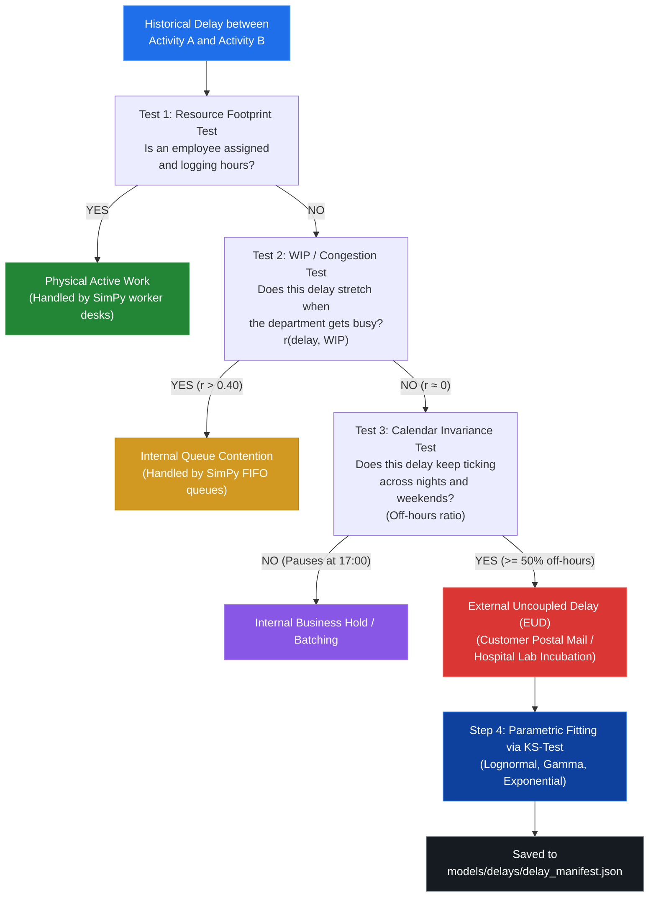

# Causal Delay Discovery Engine

---

## The Triple Causal Test Flowchart

---

## Detailed Explanation of the 3 Causal Tests

### 1. Test 1: Resource Footprint Test
- **Question:** *Is an employee actively working during this interval?*
- **Mechanism:** Inspects whether `org:resource` is populated and active.
- **Verdict:** If an employee is logging hours, this time belongs to active work duration, not idle waiting.

### 2. Test 2: WIP / Congestion Test (Orthogonality)
- **Question:** *Does this delay stretch when the department gets busy?*
- **Mechanism:** Reconstructs continuous concurrent Work-in-Progress (WIP) and calculates the Pearson correlation $r(\text{delay}, \text{WIP})$.
- **Verdict:**
  - **Internal Queues:** When a department is flooded with tickets, queue times grow significantly ($r > 0.40$).
  - **External Delays:** A postal carrier or customer reading an offer at home takes 8.9 days regardless of whether the bank's internal desk queue is full or empty ($|r| < 0.25$).

### 3. Test 3: Calendar Invariance Test (The 24/7 Clock Test)
- **Question:** *Does this delay keep ticking during nights and weekends?*
- **Mechanism:** Samples points across the interval and calculates the percentage of time that elapsed during non-working hours (nights 17:00–08:00 and weekends).
- **Verdict:**
  - **Internal Office Tasks:** Pause at 17:00 and pause over weekends (off-hours $< 35\%$).
  - **External Delays:** Continue moving 24/7 over Saturday and Sunday (off-hours $\ge 50\%$).
